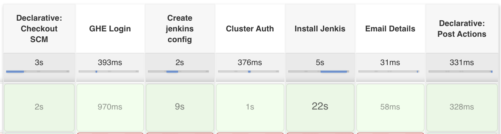

# 4-devops-with-jenkins

In this project i have create solution to provition and manage jenkins instance for multiple teams in orgnization.

## Prerequisite
- github orgnization
- Jenkins instance
- kuberenetes cluster (GKE)

## Configure Jenkins Creds
You need to configure below credentials before running onboarding job.
- teamname-ghe-token	-> Secret type credentails which holds token for GHE
- github_personal -> Usesrname pasword for github. 
- gcloud-creds -> Secret file type credentail for Gcloud service account json. ([Follow the link to create service account](https://cloud.google.com/solutions/using-jenkins-for-distributed-builds-on-compute-engine
))

## How this solution works
- Configure this repository as pipeline job in jenkins using Jenkinsfile.
- It will create Onboard-To-Jenkins job under SelfService folder.


- This job perform below task
  - Copy default vaules.yaml and create repo
  - Create a namespace for the team 
  - Create a service account for team.
  - Perform helm release of jenkins.


## Pipeline logs
```
[Pipeline] withEnv
[Pipeline] {
[Pipeline] withEnv
[Pipeline] {
[Pipeline] stage
[Pipeline] { (GHE Login)
[Pipeline] script
[Pipeline] {
[Pipeline] withCredentials
Masking supported pattern matches of $TOKEN
[Pipeline] {
[Pipeline] sh
+ echo ****
+ gh auth login --with-token
[Pipeline] }
[Pipeline] // withCredentials
[Pipeline] }
[Pipeline] // script
[Pipeline] }
[Pipeline] // stage
[Pipeline] stage
[Pipeline] { (Create jenkins config)
[Pipeline] script
[Pipeline] {
[Pipeline] sh
+ rm -rf /Users/testusr/jenkins_docker_home/home/workspace/SelfService/Onboard-To-Jenkins/.git
+ gh repo view letscode-ss/team-x-jenkins-config
GraphQL error: Could not resolve to a Repository with the name 'letscode-ss/team-x-jenkins-config'.
+ export exitcode=1
+ exitcode=1
+ '[' 1 -ne 0 ']'
+ gh repo create letscode-ss/team-x-jenkins-config -y --private
https://github.com/letscode-ss/team-x-jenkins-config
+ gh repo clone letscode-ss/team-x-jenkins-config
Cloning into 'team-x-jenkins-config'...
warning: You appear to have cloned an empty repository.
+ cp -r charts/jenkins/VALUES_SUMMARY.md team-x-jenkins-config/VALUES_SUMMARY.md
+ sed s/jenkins.example.com/team-x.test-jenkins.com/g charts/jenkins/values.yaml
+ sed s/TEAMNAME/team-x/g onboard/Readme.md
+ cd team-x-jenkins-config
+ git add Readme.md VALUES_SUMMARY.md values.yaml
+ git commit -m 'updating config code'
[master (root-commit) 752ed33] updating config code
 3 files changed, 1080 insertions(+)
 create mode 100644 Readme.md
 create mode 100644 VALUES_SUMMARY.md
 create mode 100644 values.yaml
+ git push -u origin master
To https://github.com/letscode-ss/team-x-jenkins-config.git
 * [new branch]      master -> master
Branch 'master' set up to track remote branch 'master' from 'origin'.
[Pipeline] }
[Pipeline] // script
[Pipeline] }
[Pipeline] // stage
[Pipeline] stage
[Pipeline] { (Cluster Auth)
[Pipeline] script
[Pipeline] {
[Pipeline] sh
+ gcloud container clusters get-credentials cluster-1 --zone=us-central1-c
Fetching cluster endpoint and auth data.
kubeconfig entry generated for cluster-1.
[Pipeline] }
[Pipeline] // script
[Pipeline] }
[Pipeline] // stage
[Pipeline] stage
[Pipeline] { (Install Jenkis)
[Pipeline] script
[Pipeline] {
[Pipeline] sh
+ sed s/NAMESPACE/team-x-21/g onboard/namespace.yaml
+ sed s/NAMESPACE/team-x-21/g onboard/serviceaccount.yaml
+ kubectl apply -f onboard/namespace-apply.yaml
namespace/team-x-21 unchanged
+ kubectl apply -f onboard/serviceaccount-apply.yaml
serviceaccount/team-x-21-admin unchanged
role.rbac.authorization.k8s.io/team-x-21-admin unchanged
rolebinding.rbac.authorization.k8s.io/team-x-21-admin-rolebinding unchanged
clusterrole.rbac.authorization.k8s.io/team-x-21-ClusterRole unchanged
clusterrolebinding.rbac.authorization.k8s.io/team-x-21-ClusterRoleBinding unchanged
+ kubectl config set-context --current --namespace=team-x-21
Context "gke_vast-operator-277120_us-central1-c_cluster-1" modified.
+ helm upgrade --install jenkins-team-x-21 --values team-x-jenkins-config/values.yaml charts/jenkins/
Release "jenkins-team-x-21" does not exist. Installing it now.
NAME: jenkins-team-x-21
LAST DEPLOYED: Sun Oct 18 13:03:45 2020
NAMESPACE: team-x-21
STATUS: deployed
REVISION: 1
NOTES:
1. Get your 'admin' user password by running:
  printf $(kubectl get secret --namespace team-x-21 jenkins-team-x-21 -o jsonpath="{.data.jenkins-admin-password}" | base64 --decode);echo

2. Visit http://team-x.test-jenkins.com

3. Login with the password from step 1 and the username: admin

4. Use Jenkins Configuration as Code by specifying configScripts in your values.yaml file, see documentation: http://team-x.test-jenkins.com/configuration-as-code and examples: https://github.com/jenkinsci/configuration-as-code-plugin/tree/master/demos

For more information on running Jenkins on Kubernetes, visit:
https://cloud.google.com/solutions/jenkins-on-container-engine
For more information about Jenkins Configuration as Code, visit:
https://jenkins.io/projects/jcasc/
[Pipeline] }
[Pipeline] // script
[Pipeline] }
[Pipeline] // stage
[Pipeline] stage
[Pipeline] { (Email Details)
[Pipeline] script
[Pipeline] {
[Pipeline] echo
TODO: Email jenkins details to user
[Pipeline] }
[Pipeline] // script
[Pipeline] }
[Pipeline] // stage
[Pipeline] stage
[Pipeline] { (Declarative: Post Actions)
[Pipeline] script
[Pipeline] {
[Pipeline] sh
+ rm -rf /tmp/token.txt
+ echo github logout
github logout
[Pipeline] }
[Pipeline] // script
[Pipeline] }
[Pipeline] // stage
[Pipeline] }
[Pipeline] // withEnv
[Pipeline] }
[Pipeline] // withEnv
[Pipeline] }
[Pipeline] // node
[Pipeline] End of Pipeline
Finished: SUCCESS
```

## Running Jenkins can be interacted with kubectl 
```
kubectl get pod -n team-x-21
NAME                                 READY   STATUS    RESTARTS   AGE
jenkins-team-x-21-59cf867f6d-gwlm8   2/2     Running   0          2m22s
kubectl get ingress -n team-x-21
NAME                HOSTS                     ADDRESS         PORTS   AGE
jenkins-team-x-21   team-x.test-jenkins.com   xx.xx.xx.xx   80      2m29s
kubectl get svc -n team-x-21
NAME                      TYPE        CLUSTER-IP    EXTERNAL-IP   PORT(S)          AGE
jenkins-team-x-21         NodePort    10.8.12.163   <none>        8080:31389/TCP   2m54s
jenkins-team-x-21-agent   ClusterIP   10.8.13.27    <none>        50000/TCP        2m54s
```

## Future enhancement
- Switch onboarding pipeline agent from master to kubernetes to avoid many cli tools on master - DONE
- GHE oauth integration
- Enable SSL
- Enable Github orgnization job in jenkins
